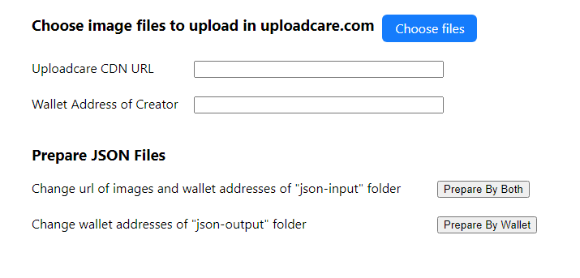
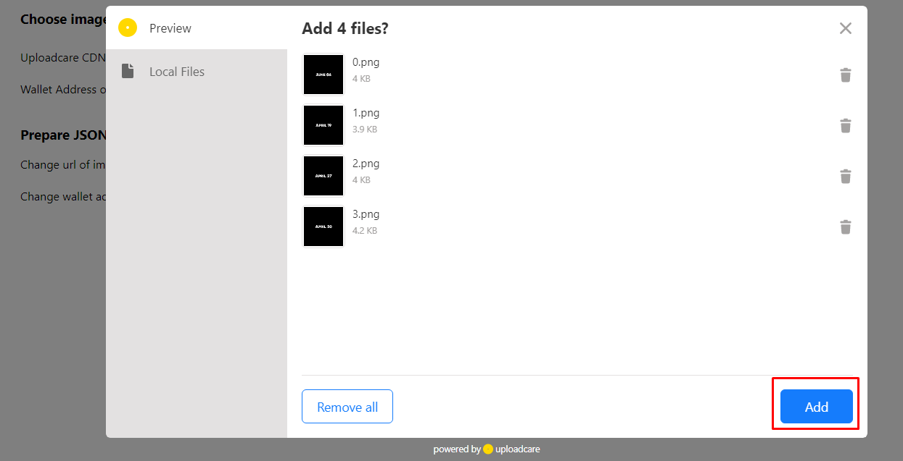
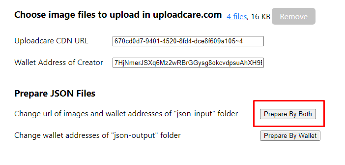
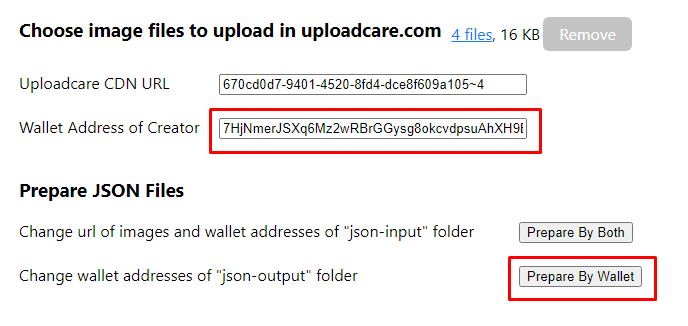

# Uploadcare-Metadata

Uploadcare-Metadata project is designed to let users upload images to [uploadcare.com](https://uploadcare.com) and prepare json files from original json of input by changing image url and wallet address.

### Scripts

In the project directory, you can run:

1. `yarn start-api`

Run the app api. API will be open [http://localhost:8901](http://localhost:8901).

2. `yarn start`

Run the app. App will be launched to [http://localhost:8900](http://localhost:8900).

### Usage

Before start, one should set configuration of uploadcare public api key and total image counts to `src/conf/confing.json`.

```
{
    "pubapikey" : "cdefab2ccc7cdcd6ca6f",
    "image_count" : 4
}
```

In the browser, one can see the app like this.



1. Prepare images and json files.

Place images in `assets/image` folder and input json files in `assets/json-input` folder.
Count of images and json files should be equal and filename of image and json should be matched.

2. Choose image files.

Press `Choose files` button, add local images to uploadcare.com and upload them.



3. Input wallet address.

Copy and paste creator wallet address to Wallet address input of the page.

4. Prepare json files.

By pressing `Prepare by Both`, then json files would be prepared to `assets/json-output` folder by changing image urls and wallet addresses.



For more, to only change wallet address, one should change wallet address of json files in `assets/json-output` by pressing `Prepare by Wallet` button.


